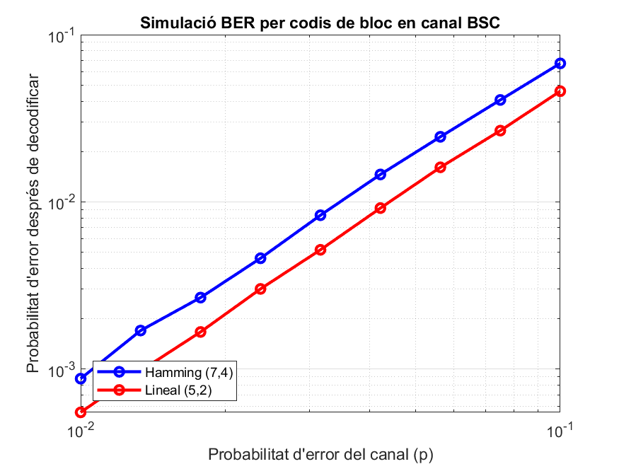

# Block Codes BER Simulation (MATLAB)


---

## 📌 Overview

This project implements a **MATLAB simulation** of block codes over a **Binary Symmetric Channel (BSC)** to analyze the **Bit Error Rate (BER)** performance. The goal is to compare two families of linear block codes:

* **Hamming (7,4) code**
* **General linear (5,2) code**

The simulation encodes random bit sequences, transmits them through a BSC with varying error probabilities, decodes the received sequences, and computes the resulting BER. The results are plotted and discussed in relation to redundancy, minimum distance, and error correction capabilities.

This repository is part of the **Digital Communications coursework (2024–2025)**.

---

## 📂 Repository Structure

```
<repo>/
├─ src/                     # MATLAB source code
│  └─ simulate_block_codes.m
├─ test/                    # Placeholder for future test scripts
├─ docs/                    # Reports and written documentation
│  ├─ Memoria_AC2.pdf       # Project report (Catalan)
│  ├─ Activitat pràctica AC2.pdf  # Original assignment statement
│  └─ assets/               # Figures and simulation results
│     └─ grafica_BER_AC2.png
├─ build/                   # Temporary outputs (ignored)
└─ README.md                # Project documentation
```

---

## ⚙️ How to Run

Run the MATLAB simulation script from the repository root:

```powershell
# Run in MATLAB headless mode
tmatlab -batch "run('src/simulate_block_codes.m')"
```

This will:

1. Generate random bit sequences.
2. Encode them using Hamming (7,4) and linear (5,2) codes.
3. Transmit them through a BSC with 9 logarithmically spaced error probabilities (0.01 → 0.1).
4. Decode the received words.
5. Compute and display BER for both codes.
6. Save the resulting BER plot to `docs/assets/grafica_BER_AC2.png`.

---

## 📊 Results

The script produces a **log-log BER curve** comparing the two codes:

* **Hamming (7,4)** → blue line
* **Linear (5,2)** → red line

The plot visually shows how each code performs as channel error probability increases.



---

## 📖 Theoretical Background

### Hamming (7,4) Code

* Parameters: (n=7, k=4)
* Minimum distance: d\_min = 3
* Error detection: up to 2 errors per word
* Error correction: up to 1 error per word

### General Linear (5,2) Code

* Parameters: (n=5, k=2)
* Minimum distance: d\_min = 3
* Error detection: up to 2 errors per word
* Error correction: up to 1 error per word

Despite both having the same theoretical minimum distance, their performance differs due to structure and redundancy.

---

## 🔍 Discussion

* The **linear (5,2) code** showed slightly better BER performance than Hamming (7,4) in this simulation.
* This suggests that efficiency depends not only on minimum distance, but also on code structure and redundancy.
* Hamming codes remain widely used in hardware implementations due to their standardization and ease of decoding.

---

## 📚 What I Learned

Through this project I gained experience in:

* MATLAB programming for digital communications.
* Simulation of linear block codes and error correction.
* Working with the Communications Toolbox functions (`encode`, `decode`, `syndtable`, `bsc`, `biterr`).
* Evaluating coding efficiency in terms of redundancy and BER.
* Structuring academic code into a professional repository format.

---

## 📜 License

This project is released under the [MIT License](LICENSE).
